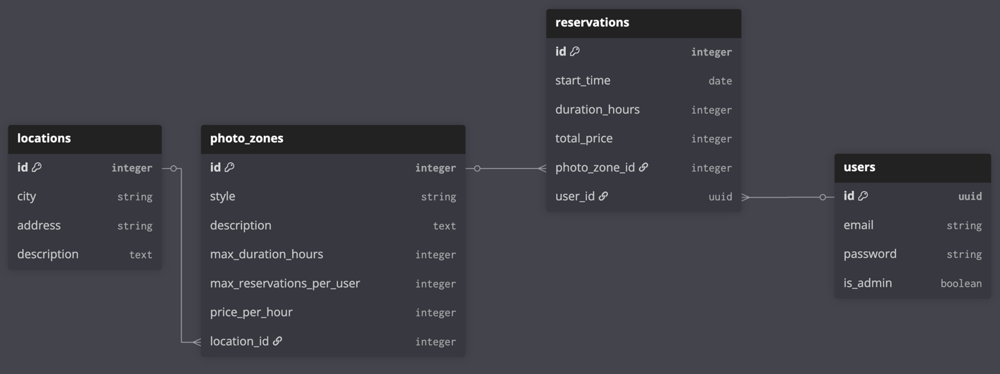

```
Table users {
  id uuid [pk]
  email string 
  password string 
  is_admin boolean
}

Table photo_zones {
  id integer [pk]
  name string
  picture string
  style string
  description text
  price_per_hour integer 
  location string
}

Table reservations {
  id integer [pk]
  name string
  date string
  time string
  duration_hours integer
  total_price integer
  PhotoZoneId integer [ref: > photo_zones.id]
  UserId uuid [ref: > users.id]
}
```